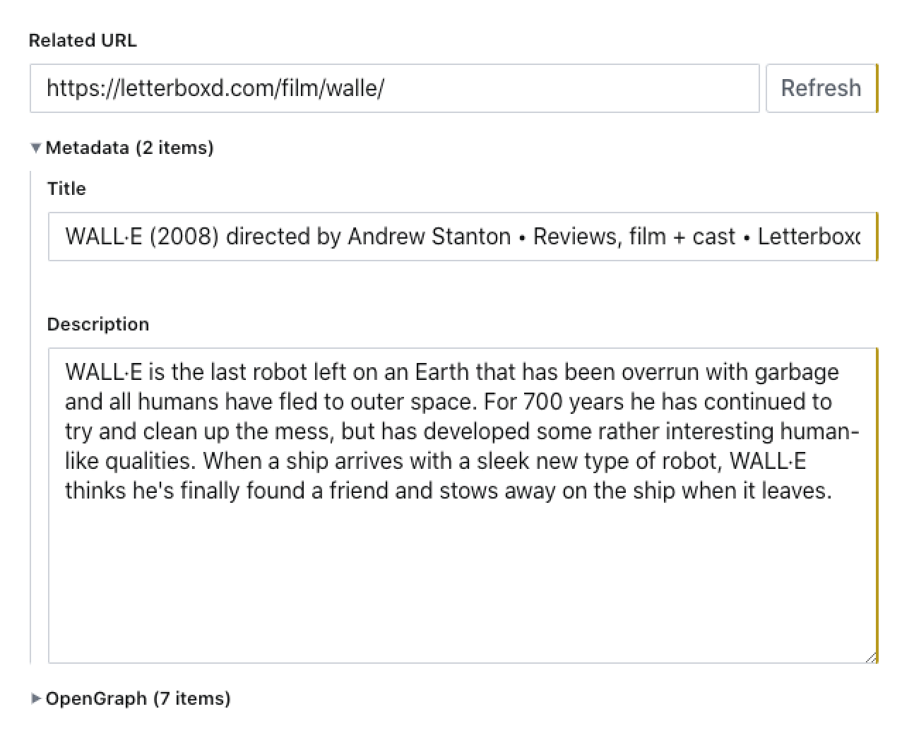

# sanity-plugin-url-metadata-input

URL input for [Sanity](https://sanity.io/) that retrieves metadata (title, description) along with [OpenGraph](http://ogp.me/) information.

Note: The resolving is done by an addon to the Sanity API and usage will at some point be an opt-in addon that is billed.



## Installation

```
sanity install url-metadata-input
```

## Usage

Use it in your schema types:

```js
// [...]
{
  fields: [
    // [...]
    {
      name: 'relatedUrl',
      title: 'Related URL',
      type: 'urlWithMetadata',
    },
  ]
}
```

If you want the metadata below the URL field to be collapsed, set the `collapsed` option like so:

```js
{
  name: 'relatedUrl',
  title: 'Related URL',
  type: 'urlWithMetadata',
  options: {
    collapsed: true,
  }
},
```

## Data model

Note: Empty keys are not included

```js
{
  _type: 'urlWithMetadata',

  // Raw user-input URL
  url: 'http://sanity.io',

  // Resolved URL after redirects
  resolvedUrl: 'https://sanity.io/',

  // Date when the metada resolving was performed
  crawledAt: '2017-09-01T09:48:35.501Z',

  // Basic metadata (from <head> of the page)
  meta: {
    title: 'Sanity – The fully customizable, headless CMS',
    description: 'Manage structured data collaboratively [...]'
  },

  // OpenGraph data (camelcased keys, eg `og:video:width` == `videoWidth`)
  // See http://ogp.me/ for more information
  openGraph: {
    title: '...',
    description: '...',
    siteName: '...',
    type: '...',
    url: '...',
    image: '...',
    imageAlt: '...',
    imageSecureUrl: '...',
    imageType: '...',
    imageHeight: '...',
    imageWidth: '...',
    audio: '...',
    audioSecureUrl: '...',
    audioType: '...',
    determiner: '...',
    locale: '...',
    video: '...',
    videoSecureUrl: '...',
    videoType: '...',
    videoHeight: '...',
    videoWidth: '...',
  }
}
```

## License

MIT-licensed. See LICENSE.
